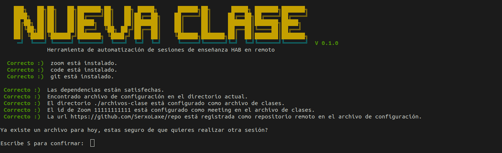

# NUEVA-CLASE

Nueva Clase es un script escrito en Bash que automatiza algunos aspectos de las clases en remoto cursadas en Hack a Boss. Crea un repositorio local en el que almacena ordenadamente los archivos usados cada día, también se conecta a los meetings de Zoom y, al finalizar la clase, sube a un repositorio remoto todo lo creado.



## Instalación

Clona este repositorio para instalar nueva-clase.

```bash
git clone url
cd nueva-clase
chmod +x nueva-clase.sh
./nueva-clase configurar

```

## Uso

```bash

nueva-clase comenzar    # Comienza la sesión de clase.
nueva-clase finalizar   # Finaliza la sesión de clase
nueva-clase configurar  # Configura el script.
nueva-clase ayuda       # Muestra un menú con estos argumentos.
```

## TODO
* Automatizar completamente el acceso a los meetings de Zoom.
* Al finalizar, cerrar VS Code y Zoom.
* Opción de añadir y eliminar tareas a crontab dentro del propio script.


## License
[MIT](https://choosealicense.com/licenses/mit/)